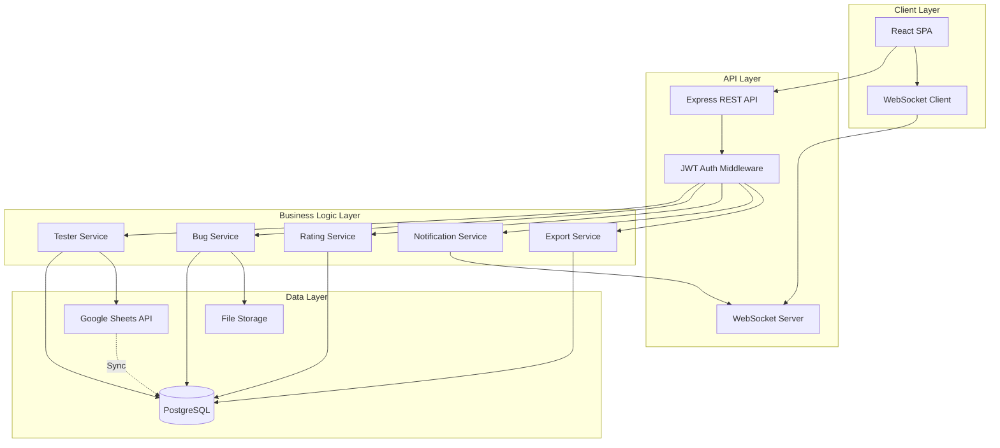
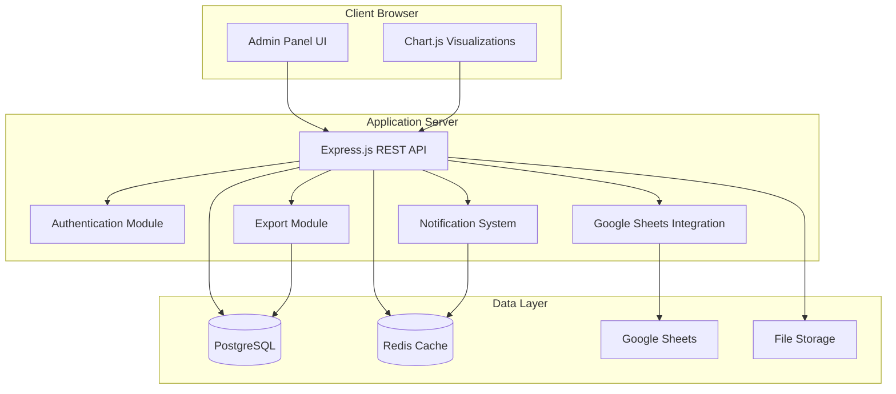
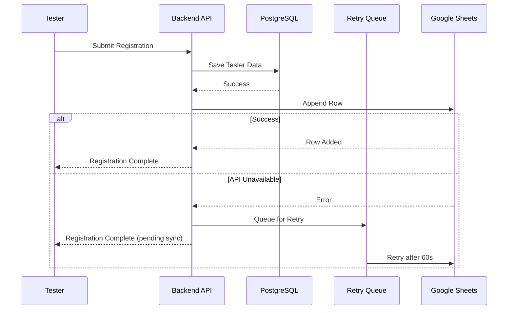
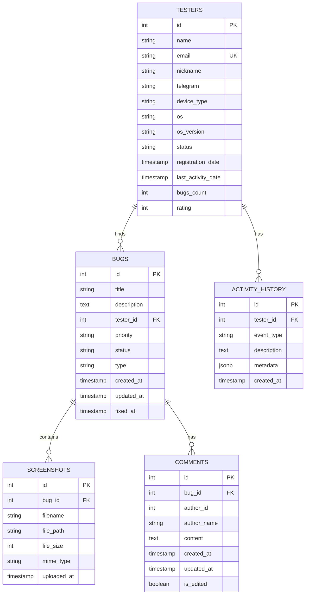

# Design Document: LIVE RUSSIA Tester Dashboard

## Overview

Веб-приложение для управления тестировщиками мобильного проекта LIVE RUSSIA представляет собой административную панель с интеграцией Google Sheets. Система обеспечивает регистрацию тестеров, управление багами, мониторинг статистики серверов и визуализацию активности игроков.

### Ключевые возможности

- Регистрация тестеров с автоматической синхронизацией в Google Sheets
- Административная панель с боковым меню в стиле LIVE RUSSIA
- Управление багами с приоритетами, статусами и скриншотами
- Система рейтинга тестеров на основе найденных багов
- Мониторинг статистики серверов в реальном времени
- Графики онлайн игроков с различными временными периодами
- Экспорт отчетов в CSV и PDF форматы
- Система уведомлений о важных событиях

### Технологический стек

**Frontend:**
- HTML5, CSS3, JavaScript (ES6+)
- Chart.js для визуализации графиков
- Responsive design с использованием CSS Grid и Flexbox

**Backend:**
- Node.js с Express.js
- Google Sheets API v4 для интеграции с таблицами
- OAuth 2.0 для аутентификации Google API

**Database:**
- PostgreSQL для хранения данных тестеров, багов, комментариев
- Redis для кэширования и управления сессиями

**Authentication:**
- bcrypt для хеширования паролей
- express-session для управления сессиями

**File Storage:**
- Локальное хранилище или AWS S3 для скриншотов багов: LIVE RUSSIA Tester Dashboard

## Overview

Веб-приложение для управления тестировщиками мобильного проекта LIVE RUSSIA представляет собой полнофункциональную административную панель с интеграцией Google Sheets API. Система обеспечивает регистрацию тестеров, мониторинг их активности, управление багами, рейтинговую систему и визуализацию статистики в реальном времени.

### Key Design Decisions

1. **Архитектура**: Single Page Application (SPA) с серверным API для обеспечения быстрого отклика и современного пользовательского опыта
2. **Технологический стек**: React для фронтенда, Node.js/Express для бэкенда, PostgreSQL для хранения данных
3. **Интеграция**: Google Sheets API v4 для двунаправленной синхронизации данных
4. **Аутентификация**: JWT-токены с bcrypt хешированием паролей
5. **Real-time обновления**: WebSocket соединения для мгновенного обновления дашборда
6. **Адаптивность**: Mobile-first подход с использованием CSS Grid и Flexbox

## Architecture

### System Architecture



### Component Architecture

Система разделена на следующие основные компоненты:

1. **Frontend (React SPA)**
   - Dashboard Component: главная страница со статистикой
   - Tester Management Component: управление тестерами
   - Bug Management Component: управление багами
   - Server Statistics Component: мониторинг серверов
   - Online Players Chart Component: графики онлайн игроков
   - Authentication Component: авторизация

2. **Backend (Node.js/Express)**
   - REST API endpoints для CRUD операций
   - WebSocket server для real-time обновлений
   - Google Sheets Integration Service
   - Authentication & Authorization Service
   - File Upload Service

3. **Database (PostgreSQL)**
   - Реляционная модель данных
   - Индексы для оптимизации запросов
   - Транзакции для целостности данных

## Components and Interfaces

### Frontend Components

#### 1. Dashboard Component
**Responsibilities:**
- Отображение общей статистики системы
- Визуализация метрик тестеров
- Отображение топ-10 рейтинга тестеров
- Графики распределения багов

**Props:**
```typescript
interface DashboardProps {
  refreshInterval?: number; // default: 30000ms
}
```

**State:**
```typescript
interface DashboardState {
  totalTesters: number;
  activeTesters24h: number;
  testersByDevice: Record<string, number>;
  testersByOS: Record<string, number>;
  topTesters: Tester[];
  bugStatistics: BugStatistics;
  loading: boolean;
}
```

#### 2. TesterTable Component
**Responsibilities:**
- Отображение таблицы всех тестеров
- Сортировка, фильтрация, поиск
- Пагинация
- Редактирование статуса тестера

**Props:**
```typescript
interface TesterTableProps {
  pageSize?: number; // default: 20
  onTesterClick: (testerId: string) => void;
}
```

#### 3. BugManagement Component
**Responsibilities:**
- Отображение списка багов
- Создание, редактирование, удаление багов
- Фильтрация по статусу, приоритету, тестеру
- Прикрепление скриншотов
- Система комментариев

**Props:**
```typescript
interface BugManagementProps {
  testerId?: string; // для фильтрации по тестеру
}
```

#### 4. RegistrationForm Component
**Responsibilities:**
- Форма регистрации нового тестера
- Валидация полей
- Отправка данных на сервер

**Props:**
```typescript
interface RegistrationFormProps {
  onSuccess: () => void;
  onError: (error: string) => void;
}
```

#### 5. ServerStatistics Component
**Responsibilities:**
- Отображение статуса серверов
- Цветовая индикация состояния
- Автообновление каждые 15 секунд

**State:**
```typescript
interface ServerStatisticsState {
  servers: Server[];
  lastUpdate: Date;
}
```

#### 6. OnlinePlayersChart Component
**Responsibilities:**
- Отображение графика онлайн игроков
- Фильтрация по временным периодам
- Отображение пиковых значений

**Props:**
```typescript
interface OnlinePlayersChartProps {
  defaultPeriod?: '1h' | '6h' | '24h' | '7d'; // default: '24h'
  refreshInterval?: number; // default: 60000ms
}
```

### Backend API Endpoints

#### Authentication Endpoints
```
POST /api/auth/login
  Body: { username: string, password: string }
  Response: { token: string, expiresIn: number }

POST /api/auth/logout
  Headers: { Authorization: "Bearer <token>" }
  Response: { success: boolean }

GET /api/auth/verify
  Headers: { Authorization: "Bearer <token>" }
  Response: { valid: boolean, user: User }
```

#### Tester Endpoints
```
POST /api/testers
  Body: { name: string, email: string, nickname: string, telegram: string, 
          deviceType: string, osVersion: string }
  Response: { tester: Tester, id: string }

GET /api/testers
  Query: { page?: number, pageSize?: number, search?: string, 
           deviceType?: string, os?: string, sortBy?: string, sortOrder?: 'asc'|'desc' }
  Response: { testers: Tester[], total: number, page: number, pageSize: number }

GET /api/testers/:id
  Response: { tester: Tester }

PATCH /api/testers/:id
  Body: { status?: string, [other fields] }
  Response: { tester: Tester }

GET /api/testers/:id/bugs
  Response: { bugs: Bug[] }

GET /api/testers/:id/activity
  Query: { eventType?: string }
  Response: { activities: Activity[] }
```

#### Bug Endpoints
```
POST /api/bugs
  Body: { title: string, description: string, testerId: string, 
          priority: string, status: string, type: string }
  Response: { bug: Bug, id: string }

GET /api/bugs
  Query: { status?: string, priority?: string, testerId?: string, 
           type?: string, search?: string }
  Response: { bugs: Bug[], total: number }

GET /api/bugs/:id
  Response: { bug: Bug, comments: Comment[], attachments: Attachment[] }

PATCH /api/bugs/:id
  Body: { status?: string, priority?: string, [other fields] }
  Response: { bug: Bug }

POST /api/bugs/:id/comments
  Body: { text: string }
  Response: { comment: Comment }

PATCH /api/bugs/:id/comments/:commentId
  Body: { text: string }
  Response: { comment: Comment }

DELETE /api/bugs/:id/comments/:commentId
  Response: { success: boolean }

POST /api/bugs/:id/attachments
  Body: FormData with image file
  Response: { attachment: Attachment }

DELETE /api/bugs/:id/attachments/:attachmentId
  Response: { success: boolean }
```

#### Statistics Endpoints
```
GET /api/statistics/dashboard
  Response: { 
    totalTesters: number,
    activeTesters24h: number,
    testersByDevice: Record<string, number>,
    testersByOS: Record<string, number>,
    totalBugs: number,
    bugsByStatus: Record<string, number>,
    bugsByPriority: Record<string, number>,
    bugsByType: Record<string, number>
  }

GET /api/statistics/testers/top
  Query: { limit?: number }
  Response: { topTesters: TesterWithRating[] }

GET /api/statistics/bugs/average-fix-time
  Response: { averageFixTime: Record<string, number> }
```

#### Server Monitoring Endpoints
```
GET /api/servers
  Response: { servers: Server[] }

GET /api/servers/:id
  Response: { server: Server }
```

#### Online Players Endpoints
```
GET /api/online-players
  Query: { period: '1h'|'6h'|'24h'|'7d' }
  Response: { 
    data: Array<{ timestamp: Date, count: number }>,
    peak: { count: number, timestamp: Date }
  }
```

#### Export Endpoints
```
GET /api/export/testers
  Query: { format: 'csv'|'pdf', filters?: string }
  Response: File download

GET /api/export/bugs
  Query: { format: 'csv'|'pdf', filters?: string }
  Response: File download
```

#### Notification Endpoints
```
GET /api/notifications
  Query: { unreadOnly?: boolean }
  Response: { notifications: Notification[], unreadCount: number }

PATCH /api/notifications/:id/read
  Response: { notification: Notification }

DELETE /api/notifications/:id
  Response: { success: boolean }
```

### WebSocket Events

#### Client → Server
```
subscribe:dashboard - подписка на обновления дашборда
subscribe:testers - подписка на обновления тестеров
subscribe:bugs - подписка на обновления багов
subscribe:servers - подписка на обновления серверов
subscribe:online-players - подписка на обновления онлайн игроков
unsubscribe:<channel> - отписка от канала
```

#### Server → Client
```
dashboard:update - обновление статистики дашборда
tester:new - новый тестер зарегистрирован
tester:updated - данные тестера обновлены
bug:new - новый баг создан
bug:updated - баг обновлен
server:status-changed - статус сервера изменился
online-players:update - обновление данных онлайн игроков
notification:new - новое уведомление
```

### Google Sheets Integration Service

**Interface:**
```typescript
interface GoogleSheetsService {
  // Запись данных тестера в таблицу
  appendTester(tester: Tester): Promise<void>;
  
  // Чтение всех тестеров из таблицы
  fetchTesters(): Promise<Tester[]>;
  
  // Обновление строки тестера
  updateTester(testerId: string, data: Partial<Tester>): Promise<void>;
  
  // Проверка доступности API
  checkConnection(): Promise<boolean>;
  
  // Повторная попытка отправки при ошибке
  retryFailedOperations(): Promise<void>;
}
```

**Configuration:**
- OAuth 2.0 credentials из Google Cloud Console
- Spreadsheet ID из конфигурации
- Retry logic: максимум 3 попытки с экспоненциальной задержкой
- Local queue для операций при недоступности API

## Data Models

### Database Schema

#### Testers Table
```sql
CREATE TABLE testers (
  id UUID PRIMARY KEY DEFAULT gen_random_uuid(),
  name VARCHAR(255) NOT NULL,
  email VARCHAR(255) NOT NULL UNIQUE,
  nickname VARCHAR(100),
  telegram VARCHAR(100),
  device_type VARCHAR(50) NOT NULL,
  os_version VARCHAR(50) NOT NULL,
  status VARCHAR(20) DEFAULT 'active' CHECK (status IN ('active', 'inactive', 'suspended')),
  registration_date TIMESTAMP DEFAULT CURRENT_TIMESTAMP,
  last_activity_date TIMESTAMP,
  google_sheets_row_id INTEGER,
  created_at TIMESTAMP DEFAULT CURRENT_TIMESTAMP,
  updated_at TIMESTAMP DEFAULT CURRENT_TIMESTAMP
);

CREATE INDEX idx_testers_email ON testers(email);
CREATE INDEX idx_testers_status ON testers(status);
CREATE INDEX idx_testers_registration_date ON testers(registration_date DESC);
```

#### Bugs Table
```sql
CREATE TABLE bugs (
  id UUID PRIMARY KEY DEFAULT gen_random_uuid(),
  title VARCHAR(500) NOT NULL,
  description TEXT NOT NULL,
  tester_id UUID NOT NULL REFERENCES testers(id) ON DELETE CASCADE,
  priority VARCHAR(20) NOT NULL CHECK (priority IN ('low', 'medium', 'high', 'critical')),
  status VARCHAR(20) NOT NULL CHECK (status IN ('new', 'in_progress', 'fixed', 'closed')),
  type VARCHAR(50) NOT NULL CHECK (type IN ('UI', 'functionality', 'performance', 'crash', 'security', 'other')),
  created_at TIMESTAMP DEFAULT CURRENT_TIMESTAMP,
  updated_at TIMESTAMP DEFAULT CURRENT_TIMESTAMP,
  fixed_at TIMESTAMP
);

CREATE INDEX idx_bugs_tester_id ON bugs(tester_id);
CREATE INDEX idx_bugs_status ON bugs(status);
CREATE INDEX idx_bugs_priority ON bugs(priority);
CREATE INDEX idx_bugs_type ON bugs(type);
CREATE INDEX idx_bugs_created_at ON bugs(created_at DESC);
```

#### Comments Table
```sql
CREATE TABLE comments (
  id UUID PRIMARY KEY DEFAULT gen_random_uuid(),
  bug_id UUID NOT NULL REFERENCES bugs(id) ON DELETE CASCADE,
  author_id UUID NOT NULL REFERENCES admins(id),
  text TEXT NOT NULL,
  created_at TIMESTAMP DEFAULT CURRENT_TIMESTAMP,
  updated_at TIMESTAMP DEFAULT CURRENT_TIMESTAMP,
  is_edited BOOLEAN DEFAULT FALSE
);

CREATE INDEX idx_comments_bug_id ON comments(bug_id);
CREATE INDEX idx_comments_created_at ON comments(created_at);
```

#### Attachments Table
```sql
CREATE TABLE attachments (
  id UUID PRIMARY KEY DEFAULT gen_random_uuid(),
  bug_id UUID NOT NULL REFERENCES bugs(id) ON DELETE CASCADE,
  filename VARCHAR(255) NOT NULL,
  file_path VARCHAR(500) NOT NULL,
  file_size INTEGER NOT NULL,
  mime_type VARCHAR(100) NOT NULL,
  created_at TIMESTAMP DEFAULT CURRENT_TIMESTAMP
);

CREATE INDEX idx_attachments_bug_id ON attachments(bug_id);
```

#### Activity_History Table
```sql
CREATE TABLE activity_history (
  id UUID PRIMARY KEY DEFAULT gen_random_uuid(),
  tester_id UUID NOT NULL REFERENCES testers(id) ON DELETE CASCADE,
  event_type VARCHAR(50) NOT NULL CHECK (event_type IN ('registration', 'bug_found', 'status_changed')),
  description TEXT,
  timestamp TIMESTAMP DEFAULT CURRENT_TIMESTAMP
);

CREATE INDEX idx_activity_tester_id ON activity_history(tester_id);
CREATE INDEX idx_activity_timestamp ON activity_history(timestamp DESC);
CREATE INDEX idx_activity_event_type ON activity_history(event_type);
```

#### Admins Table
```sql
CREATE TABLE admins (
  id UUID PRIMARY KEY DEFAULT gen_random_uuid(),
  username VARCHAR(100) NOT NULL UNIQUE,
  password_hash VARCHAR(255) NOT NULL,
  created_at TIMESTAMP DEFAULT CURRENT_TIMESTAMP,
  last_login TIMESTAMP
);

CREATE INDEX idx_admins_username ON admins(username);
```

#### Notifications Table
```sql
CREATE TABLE notifications (
  id UUID PRIMARY KEY DEFAULT gen_random_uuid(),
  type VARCHAR(50) NOT NULL CHECK (type IN ('new_tester', 'critical_bug', 'server_offline')),
  title VARCHAR(255) NOT NULL,
  message TEXT NOT NULL,
  is_read BOOLEAN DEFAULT FALSE,
  created_at TIMESTAMP DEFAULT CURRENT_TIMESTAMP
);

CREATE INDEX idx_notifications_is_read ON notifications(is_read);
CREATE INDEX idx_notifications_created_at ON notifications(created_at DESC);
```

#### Servers Table
```sql
CREATE TABLE servers (
  id UUID PRIMARY KEY DEFAULT gen_random_uuid(),
  name VARCHAR(100) NOT NULL,
  status VARCHAR(20) NOT NULL CHECK (status IN ('online', 'warning', 'offline')),
  load_percentage INTEGER CHECK (load_percentage >= 0 AND load_percentage <= 100),
  response_time_ms INTEGER,
  last_check TIMESTAMP DEFAULT CURRENT_TIMESTAMP
);

CREATE INDEX idx_servers_status ON servers(status);
```

#### Online_Players Table
```sql
CREATE TABLE online_players (
  id UUID PRIMARY KEY DEFAULT gen_random_uuid(),
  timestamp TIMESTAMP NOT NULL,
  player_count INTEGER NOT NULL,
  recorded_at TIMESTAMP DEFAULT CURRENT_TIMESTAMP
);

CREATE INDEX idx_online_players_timestamp ON online_players(timestamp DESC);
```

#### Google_Sheets_Queue Table
```sql
CREATE TABLE google_sheets_queue (
  id UUID PRIMARY KEY DEFAULT gen_random_uuid(),
  operation_type VARCHAR(20) NOT NULL CHECK (operation_type IN ('append', 'update')),
  tester_id UUID NOT NULL REFERENCES testers(id) ON DELETE CASCADE,
  payload JSONB NOT NULL,
  retry_count INTEGER DEFAULT 0,
  created_at TIMESTAMP DEFAULT CURRENT_TIMESTAMP,
  processed_at TIMESTAMP
);

CREATE INDEX idx_queue_processed ON google_sheets_queue(processed_at) WHERE processed_at IS NULL;
```

### TypeScript Interfaces

```typescript
interface Tester {
  id: string;
  name: string;
  email: string;
  nickname?: string;
  telegram?: string;
  deviceType: string;
  osVersion: string;
  status: 'active' | 'inactive' | 'suspended';
  registrationDate: Date;
  lastActivityDate?: Date;
  googleSheetsRowId?: number;
  bugsCount?: number;
  rating?: number;
}

interface Bug {
  id: string;
  title: string;
  description: string;
  testerId: string;
  testerName?: string;
  priority: 'low' | 'medium' | 'high' | 'critical';
  status: 'new' | 'in_progress' | 'fixed' | 'closed';
  type: 'UI' | 'functionality' | 'performance' | 'crash' | 'security' | 'other';
  createdAt: Date;
  updatedAt: Date;
  fixedAt?: Date;
  commentsCount?: number;
  attachmentsCount?: number;
}

interface Comment {
  id: string;
  bugId: string;
  authorId: string;
  authorName: string;
  text: string;
  createdAt: Date;
  updatedAt: Date;
  isEdited: boolean;
}

interface Attachment {
  id: string;
  bugId: string;
  filename: string;
  filePath: string;
  fileSize: number;
  mimeType: string;
  createdAt: Date;
}

interface Activity {
  id: string;
  testerId: string;
  eventType: 'registration' | 'bug_found' | 'status_changed';
  description: string;
  timestamp: Date;
}

interface Admin {
  id: string;
  username: string;
  passwordHash: string;
  createdAt: Date;
  lastLogin?: Date;
}

interface Notification {
  id: string;
  type: 'new_tester' | 'critical_bug' | 'server_offline';
  title: string;
  message: string;
  isRead: boolean;
  createdAt: Date;
}

interface Server {
  id: string;
  name: string;
  status: 'online' | 'warning' | 'offline';
  loadPercentage: number;
  responseTimeMs: number;
  lastCheck: Date;
}

interface OnlinePlayerData {
  id: string;
  timestamp: Date;
  playerCount: number;
  recordedAt: Date;
}

interface BugStatistics {
  total: number;
  byStatus: Record<string, number>;
  byPriority: Record<string, number>;
  byType: Record<string, number>;
  averageFixTime: Record<string, number>;
}

interface DashboardStatistics {
  totalTesters: number;
  activeTesters24h: number;
  testersByDevice: Record<string, number>;
  testersByOS: Record<string, number>;
  bugStatistics: BugStatistics;
}
```


## Architecture

### Архитектурный стиль

Система построена на трехуровневой архитектуре (Three-tier architecture):

1. **Presentation Layer** - Frontend интерфейс администратора
2. **Application Layer** - Backend API и бизнес-логика
3. **Data Layer** - PostgreSQL база данных и Google Sheets интеграция

### Архитектурная диаграмма



### Модульная структура

**Frontend Modules:**
- `auth-module.js` - Управление авторизацией
- `dashboard-module.js` - Главный дашборд со статистикой
- `testers-module.js` - Управление тестерами
- `bugs-module.js` - Управление багами
- `charts-module.js` - Визуализация графиков
- `notifications-module.js` - Система уведомлений
- `export-module.js` - Экспорт отчетов

**Backend Modules:**
- `routes/` - API endpoints
  - `auth.routes.js`
  - `testers.routes.js`
  - `bugs.routes.js`
  - `stats.routes.js`
  - `export.routes.js`
- `services/` - Бизнес-логика
  - `auth.service.js`
  - `testers.service.js`
  - `bugs.service.js`
  - `googleSheets.service.js`
  - `rating.service.js`
  - `notification.service.js`
- `models/` - Модели данных
  - `Tester.model.js`
  - `Bug.model.js`
  - `Comment.model.js`
  - `Activity.model.js`
- `middleware/` - Промежуточное ПО
  - `auth.middleware.js`
  - `validation.middleware.js`
  - `upload.middleware.js`

### Интеграция с Google Sheets

**Архитектура синхронизации:**



### Безопасность

- HTTPS для всех соединений
- bcrypt с минимум 10 salt rounds для паролей
- CSRF токены для форм
- Rate limiting для API endpoints
- Валидация и санитизация всех входных данных
- OAuth 2.0 для Google Sheets API
- Сессии с истечением через 24 часа


## Components and Interfaces

### Frontend Components

#### 1. Authentication Component

**Responsibilities:**
- Отображение формы входа
- Валидация учетных данных
- Управление сессией пользователя
- Редирект на дашборд после успешной авторизации

**Interface:**
```javascript
class AuthComponent {
  login(username, password)
  logout()
  checkSession()
  redirectToLogin()
}
```

#### 2. Sidebar Navigation Component

**Responsibilities:**
- Отображение бокового меню
- Навигация между разделами
- Подсветка активного пункта меню
- Адаптивное сворачивание в hamburger menu

**Interface:**
```javascript
class SidebarComponent {
  render()
  setActiveItem(itemId)
  toggleMobile()
}
```

#### 3. Dashboard Component

**Responsibilities:**
- Отображение общей статистики
- Карточки с метриками (total testers, active testers, bugs count)
- Графики распределения багов
- Топ-10 тестеров по рейтингу

**Interface:**
```javascript
class DashboardComponent {
  loadStatistics()
  renderMetricCards()
  renderBugCharts()
  renderTopTesters()
  refreshData()
}
```

#### 4. Testers Table Component

**Responsibilities:**
- Отображение таблицы тестеров
- Сортировка по колонкам
- Фильтрация по device type, OS, status
- Поиск по имени и email
- Пагинация

**Interface:**
```javascript
class TestersTableComponent {
  loadTesters(page, filters, sort)
  renderTable(testers)
  applyFilters(filters)
  sortByColumn(column, direction)
  search(query)
  changePage(page)
  showTesterDetails(testerId)
}
```

#### 5. Bug Management Component

**Responsibilities:**
- Отображение списка багов
- Создание нового бага
- Редактирование бага
- Фильтрация по status, priority, tester
- Загрузка скриншотов

**Interface:**
```javascript
class BugManagementComponent {
  loadBugs(filters)
  createBug(bugData)
  updateBug(bugId, updates)
  deleteBug(bugId)
  uploadScreenshot(bugId, file)
  deleteScreenshot(bugId, screenshotId)
  addComment(bugId, comment)
  loadComments(bugId)
}
```

#### 6. Charts Component

**Responsibilities:**
- Отображение графика онлайн игроков
- Фильтрация по временным периодам
- Обновление данных каждые 60 секунд
- Отображение пиковых значений

**Interface:**
```javascript
class ChartsComponent {
  renderOnlinePlayersChart(data, period)
  updateChartData(newData)
  setPeriod(period) // '1h', '6h', '24h', '7d'
  showPeakValue()
}
```

#### 7. Server Statistics Component

**Responsibilities:**
- Отображение статуса серверов
- Цветовая индикация (green/yellow/red)
- Обновление каждые 15 секунд
- Уведомления при изменении статуса

**Interface:**
```javascript
class ServerStatsComponent {
  loadServerStats()
  renderServerCards(servers)
  updateServerStatus(serverId, status)
  checkStatusChanges()
}
```

#### 8. Notification Component

**Responsibilities:**
- Отображение уведомлений в правом верхнем углу
- Автоматическое скрытие через 10 секунд
- История уведомлений
- Счетчик непрочитанных

**Interface:**
```javascript
class NotificationComponent {
  show(message, type, duration)
  dismiss(notificationId)
  loadHistory()
  markAsRead(notificationId)
  getUnreadCount()
}
```

#### 9. Export Component

**Responsibilities:**
- Экспорт данных в CSV
- Экспорт данных в PDF
- Применение текущих фильтров
- Генерация имени файла с timestamp

**Interface:**
```javascript
class ExportComponent {
  exportToCSV(data, filename)
  exportToPDF(data, filename)
  generateFilename(prefix)
}
```

### Backend API Endpoints

#### Authentication API

```
POST   /api/auth/login
POST   /api/auth/logout
GET    /api/auth/session
```

#### Testers API

```
POST   /api/testers                    # Регистрация нового тестера
GET    /api/testers                    # Получить список тестеров (с фильтрами, пагинацией)
GET    /api/testers/:id                # Получить детали тестера
PUT    /api/testers/:id                # Обновить данные тестера
PATCH  /api/testers/:id/status         # Изменить статус тестера
GET    /api/testers/:id/bugs           # Получить баги тестера
GET    /api/testers/:id/activity       # Получить историю активности
GET    /api/testers/top                # Получить топ-10 тестеров по рейтингу
```

#### Bugs API

```
POST   /api/bugs                       # Создать новый баг
GET    /api/bugs                       # Получить список багов (с фильтрами)
GET    /api/bugs/:id                   # Получить детали бага
PUT    /api/bugs/:id                   # Обновить баг
DELETE /api/bugs/:id                   # Удалить баг
PATCH  /api/bugs/:id/status            # Изменить статус бага
PATCH  /api/bugs/:id/priority          # Изменить приоритет бага
POST   /api/bugs/:id/screenshots       # Загрузить скриншот
DELETE /api/bugs/:id/screenshots/:sid  # Удалить скриншот
POST   /api/bugs/:id/comments          # Добавить комментарий
GET    /api/bugs/:id/comments          # Получить комментарии
PUT    /api/bugs/:id/comments/:cid     # Редактировать комментарий
DELETE /api/bugs/:id/comments/:cid     # Удалить комментарий
```

#### Statistics API

```
GET    /api/stats/dashboard            # Общая статистика для дашборда
GET    /api/stats/servers              # Статистика серверов
GET    /api/stats/online-players       # Данные онлайн игроков
GET    /api/stats/bugs                 # Статистика по багам
```

#### Export API

```
POST   /api/export/testers/csv         # Экспорт тестеров в CSV
POST   /api/export/testers/pdf         # Экспорт тестеров в PDF
POST   /api/export/bugs/csv            # Экспорт багов в CSV
POST   /api/export/bugs/pdf            # Экспорт багов в PDF
```

#### Notifications API

```
GET    /api/notifications              # Получить список уведомлений
GET    /api/notifications/unread       # Получить непрочитанные уведомления
PATCH  /api/notifications/:id/read     # Отметить как прочитанное
DELETE /api/notifications/:id          # Удалить уведомление
```

### Request/Response Examples

#### POST /api/testers - Регистрация тестера

**Request:**
```json
{
  "name": "Иван Петров",
  "email": "ivan@example.com",
  "nickname": "ivan_tester",
  "telegram": "@ivan_tester",
  "deviceType": "smartphone",
  "os": "Android",
  "osVersion": "13.0"
}
```

**Response:**
```json
{
  "success": true,
  "data": {
    "id": 123,
    "name": "Иван Петров",
    "email": "ivan@example.com",
    "nickname": "ivan_tester",
    "telegram": "@ivan_tester",
    "deviceType": "smartphone",
    "os": "Android",
    "osVersion": "13.0",
    "status": "active",
    "registrationDate": "2024-01-15T10:30:00Z",
    "bugsCount": 0,
    "rating": 0
  }
}
```

#### POST /api/bugs - Создание бага

**Request:**
```json
{
  "title": "Приложение крашится при входе",
  "description": "При попытке войти в аккаунт приложение закрывается",
  "testerId": 123,
  "priority": "high",
  "type": "crash",
  "status": "new"
}
```

**Response:**
```json
{
  "success": true,
  "data": {
    "id": 456,
    "title": "Приложение крашится при входе",
    "description": "При попытке войти в аккаунт приложение закрывается",
    "testerId": 123,
    "testerName": "Иван Петров",
    "priority": "high",
    "type": "crash",
    "status": "new",
    "createdAt": "2024-01-15T11:00:00Z",
    "updatedAt": "2024-01-15T11:00:00Z",
    "screenshots": [],
    "commentsCount": 0
  }
}
```

#### GET /api/stats/dashboard - Статистика дашборда

**Response:**
```json
{
  "success": true,
  "data": {
    "totalTesters": 150,
    "activeTesters24h": 45,
    "totalBugs": 320,
    "bugsByStatus": {
      "new": 45,
      "in_progress": 120,
      "fixed": 130,
      "closed": 25
    },
    "bugsByPriority": {
      "low": 80,
      "medium": 150,
      "high": 70,
      "critical": 20
    },
    "bugsByType": {
      "ui": 100,
      "functionality": 90,
      "performance": 50,
      "crash": 40,
      "security": 20,
      "other": 20
    },
    "testersByDevice": {
      "smartphone": 120,
      "tablet": 30
    },
    "testersByOS": {
      "Android": 100,
      "iOS": 50
    },
    "avgFixTime": {
      "low": 72,
      "medium": 48,
      "high": 24,
      "critical": 8
    }
  }
}
```


## Data Models

### Database Schema

#### Testers Table

```sql
CREATE TABLE testers (
  id SERIAL PRIMARY KEY,
  name VARCHAR(255) NOT NULL,
  email VARCHAR(255) UNIQUE NOT NULL,
  nickname VARCHAR(100),
  telegram VARCHAR(100),
  device_type VARCHAR(50) NOT NULL,
  os VARCHAR(50) NOT NULL,
  os_version VARCHAR(50),
  status VARCHAR(20) DEFAULT 'active',
  registration_date TIMESTAMP DEFAULT CURRENT_TIMESTAMP,
  last_activity_date TIMESTAMP,
  bugs_count INTEGER DEFAULT 0,
  rating INTEGER DEFAULT 0,
  created_at TIMESTAMP DEFAULT CURRENT_TIMESTAMP,
  updated_at TIMESTAMP DEFAULT CURRENT_TIMESTAMP
);

CREATE INDEX idx_testers_email ON testers(email);
CREATE INDEX idx_testers_status ON testers(status);
CREATE INDEX idx_testers_rating ON testers(rating DESC);
```

#### Bugs Table

```sql
CREATE TABLE bugs (
  id SERIAL PRIMARY KEY,
  title VARCHAR(500) NOT NULL,
  description TEXT NOT NULL,
  tester_id INTEGER NOT NULL REFERENCES testers(id) ON DELETE CASCADE,
  priority VARCHAR(20) NOT NULL,
  status VARCHAR(20) NOT NULL,
  type VARCHAR(50) NOT NULL,
  created_at TIMESTAMP DEFAULT CURRENT_TIMESTAMP,
  updated_at TIMESTAMP DEFAULT CURRENT_TIMESTAMP,
  fixed_at TIMESTAMP,
  CONSTRAINT fk_tester FOREIGN KEY (tester_id) REFERENCES testers(id)
);

CREATE INDEX idx_bugs_tester ON bugs(tester_id);
CREATE INDEX idx_bugs_status ON bugs(status);
CREATE INDEX idx_bugs_priority ON bugs(priority);
CREATE INDEX idx_bugs_type ON bugs(type);
CREATE INDEX idx_bugs_created ON bugs(created_at DESC);
```

#### Screenshots Table

```sql
CREATE TABLE screenshots (
  id SERIAL PRIMARY KEY,
  bug_id INTEGER NOT NULL REFERENCES bugs(id) ON DELETE CASCADE,
  filename VARCHAR(255) NOT NULL,
  file_path VARCHAR(500) NOT NULL,
  file_size INTEGER NOT NULL,
  mime_type VARCHAR(100) NOT NULL,
  uploaded_at TIMESTAMP DEFAULT CURRENT_TIMESTAMP,
  CONSTRAINT fk_bug FOREIGN KEY (bug_id) REFERENCES bugs(id)
);

CREATE INDEX idx_screenshots_bug ON screenshots(bug_id);
```

#### Comments Table

```sql
CREATE TABLE comments (
  id SERIAL PRIMARY KEY,
  bug_id INTEGER NOT NULL REFERENCES bugs(id) ON DELETE CASCADE,
  author_id INTEGER NOT NULL,
  author_name VARCHAR(255) NOT NULL,
  content TEXT NOT NULL,
  created_at TIMESTAMP DEFAULT CURRENT_TIMESTAMP,
  updated_at TIMESTAMP DEFAULT CURRENT_TIMESTAMP,
  is_edited BOOLEAN DEFAULT FALSE,
  CONSTRAINT fk_bug FOREIGN KEY (bug_id) REFERENCES bugs(id)
);

CREATE INDEX idx_comments_bug ON comments(bug_id);
CREATE INDEX idx_comments_created ON comments(created_at);
```

#### Activity History Table

```sql
CREATE TABLE activity_history (
  id SERIAL PRIMARY KEY,
  tester_id INTEGER NOT NULL REFERENCES testers(id) ON DELETE CASCADE,
  event_type VARCHAR(50) NOT NULL,
  description TEXT NOT NULL,
  metadata JSONB,
  created_at TIMESTAMP DEFAULT CURRENT_TIMESTAMP,
  CONSTRAINT fk_tester FOREIGN KEY (tester_id) REFERENCES testers(id)
);

CREATE INDEX idx_activity_tester ON activity_history(tester_id);
CREATE INDEX idx_activity_created ON activity_history(created_at DESC);
CREATE INDEX idx_activity_type ON activity_history(event_type);
```

#### Admins Table

```sql
CREATE TABLE admins (
  id SERIAL PRIMARY KEY,
  username VARCHAR(100) UNIQUE NOT NULL,
  password_hash VARCHAR(255) NOT NULL,
  email VARCHAR(255),
  created_at TIMESTAMP DEFAULT CURRENT_TIMESTAMP,
  last_login TIMESTAMP
);

CREATE INDEX idx_admins_username ON admins(username);
```

#### Notifications Table

```sql
CREATE TABLE notifications (
  id SERIAL PRIMARY KEY,
  type VARCHAR(50) NOT NULL,
  title VARCHAR(255) NOT NULL,
  message TEXT NOT NULL,
  is_read BOOLEAN DEFAULT FALSE,
  created_at TIMESTAMP DEFAULT CURRENT_TIMESTAMP,
  metadata JSONB
);

CREATE INDEX idx_notifications_read ON notifications(is_read);
CREATE INDEX idx_notifications_created ON notifications(created_at DESC);
```

### Data Model Relationships



### Enumerations

#### Tester Status
```javascript
const TesterStatus = {
  ACTIVE: 'active',
  INACTIVE: 'inactive',
  SUSPENDED: 'suspended'
};
```

#### Bug Status
```javascript
const BugStatus = {
  NEW: 'new',
  IN_PROGRESS: 'in_progress',
  FIXED: 'fixed',
  CLOSED: 'closed'
};
```

#### Bug Priority
```javascript
const BugPriority = {
  LOW: 'low',
  MEDIUM: 'medium',
  HIGH: 'high',
  CRITICAL: 'critical'
};
```

#### Bug Type
```javascript
const BugType = {
  UI: 'ui',
  FUNCTIONALITY: 'functionality',
  PERFORMANCE: 'performance',
  CRASH: 'crash',
  SECURITY: 'security',
  OTHER: 'other'
};
```

#### Device Type
```javascript
const DeviceType = {
  SMARTPHONE: 'smartphone',
  TABLET: 'tablet'
};
```

#### Activity Event Type
```javascript
const ActivityEventType = {
  REGISTRATION: 'registration',
  BUG_FOUND: 'bug_found',
  STATUS_CHANGED: 'status_changed',
  RATING_UPDATED: 'rating_updated'
};
```

#### Notification Type
```javascript
const NotificationType = {
  NEW_TESTER: 'new_tester',
  CRITICAL_BUG: 'critical_bug',
  SERVER_DOWN: 'server_down',
  INFO: 'info'
};
```

### Google Sheets Integration Schema

**Spreadsheet Structure:**

| Column A | Column B | Column C | Column D | Column E | Column F | Column G | Column H | Column I | Column J |
|----------|----------|----------|----------|----------|----------|----------|----------|----------|----------|
| ID | Name | Email | Nickname | Telegram | Device Type | OS | OS Version | Registration Date | Status |

**Mapping:**
```javascript
const SHEET_COLUMNS = {
  ID: 'A',
  NAME: 'B',
  EMAIL: 'C',
  NICKNAME: 'D',
  TELEGRAM: 'E',
  DEVICE_TYPE: 'F',
  OS: 'G',
  OS_VERSION: 'H',
  REGISTRATION_DATE: 'I',
  STATUS: 'J'
};
```

### Redis Cache Structure

**Session Storage:**
```
Key: sess:{sessionId}
Value: {userId, username, loginTime, expiresAt}
TTL: 86400 seconds (24 hours)
```

**Statistics Cache:**
```
Key: stats:dashboard
Value: {totalTesters, activeTesters24h, bugsByStatus, ...}
TTL: 30 seconds
```

**Server Status Cache:**
```
Key: stats:servers
Value: [{serverId, name, status, load, responseTime}, ...]
TTL: 15 seconds
```

**Online Players Cache:**
```
Key: stats:online:{period}
Value: [{timestamp, playerCount}, ...]
TTL: 60 seconds
```

### Data Validation Rules

**Tester Registration:**
- name: required, 2-255 characters
- email: required, valid email format, unique
- nickname: optional, 2-100 characters
- telegram: optional, starts with @ or numeric ID
- deviceType: required, one of: smartphone, tablet
- os: required, one of: Android, iOS
- osVersion: optional, version format (e.g., "13.0")

**Bug Creation:**
- title: required, 5-500 characters
- description: required, 10-5000 characters
- testerId: required, must exist in testers table
- priority: required, one of: low, medium, high, critical
- status: required, one of: new, in_progress, fixed, closed
- type: required, one of: ui, functionality, performance, crash, security, other

**Screenshot Upload:**
- file format: PNG, JPG, JPEG, GIF
- max file size: 5 MB
- max screenshots per bug: 10

**Comment:**
- content: required, 1-2000 characters
- edit window: 15 minutes after creation


## Correctness Properties

*A property is a characteristic or behavior that should hold true across all valid executions of a system-essentially, a formal statement about what the system should do. Properties serve as the bridge between human-readable specifications and machine-verifiable correctness guarantees.*

### Property 1: Registration validation rejects invalid data

*For any* registration submission with missing required fields (name, email, deviceType, os), the system SHALL reject the registration and return an error indicating which fields are missing.

**Validates: Requirements 1.2, 1.4**

### Property 2: Email validation rejects invalid formats

*For any* registration submission with an invalid email format, the system SHALL reject the registration and return an email validation error.

**Validates: Requirements 1.5**

### Property 3: Valid registration creates tester record

*For any* valid registration data (all required fields present and valid), submitting the registration SHALL create a new tester record in the database with all provided fields preserved.

**Validates: Requirements 1.3**

### Property 4: Dashboard displays required tester fields

*For any* tester record, the dashboard rendering SHALL include name, registration date, device type, status, nickname, telegram, and bugs count.

**Validates: Requirements 2.2, 12.1, 12.2, 12.3**

### Property 5: Registration increments tester count

*For any* successful tester registration, the total tester count displayed on the dashboard SHALL increase by exactly 1.

**Validates: Requirements 2.3**

### Property 6: Testers sorted by registration date

*For any* list of testers displayed on the dashboard, they SHALL be sorted by registration date in descending order (newest first).

**Validates: Requirements 2.4**

### Property 7: Google Sheets synchronization

*For any* successful tester registration, a new row SHALL be appended to the Google Spreadsheet with data mapped to the correct columns (ID→A, Name→B, Email→C, Nickname→D, Telegram→E, DeviceType→F, OS→G, OSVersion→H, RegistrationDate→I, Status→J).

**Validates: Requirements 3.1, 3.2**

### Property 8: Google Sheets write logging

*For any* successful write operation to Google Sheets, the system SHALL create a log entry with a timestamp.

**Validates: Requirements 3.5**

### Property 9: Menu navigation

*For any* menu item in the admin panel, clicking it SHALL navigate to the corresponding section and highlight that menu item as active.

**Validates: Requirements 4.3, 4.4**

### Property 10: Dashboard statistics accuracy

*For any* point in time, the dashboard SHALL display statistics that match the actual database state: total testers count, active testers in last 24 hours, testers by device type, and testers by operating system.

**Validates: Requirements 5.1, 5.2, 5.3, 5.4**

### Property 11: Server statistics display

*For any* server, the statistics display SHALL include server name, status, current load, and response time.

**Validates: Requirements 6.1, 6.3**

### Property 12: Server status color coding

*For any* server, the displayed color SHALL be green if status is "online", yellow if status is "warning", and red if status is "offline".

**Validates: Requirements 6.2**

### Property 13: Online players chart filtering

*For any* time period filter (1h, 6h, 24h, 7d), the chart SHALL display only player data within that time range.

**Validates: Requirements 7.3**

### Property 14: Peak player calculation

*For any* dataset of player counts, the displayed peak SHALL be the maximum value in the dataset along with its timestamp.

**Validates: Requirements 7.5**

### Property 15: Testers table sorting

*For any* column in the testers table, sorting by that column SHALL order all testers according to that column's values in the specified direction (ascending or descending).

**Validates: Requirements 8.2**

### Property 16: Testers table filtering

*For any* combination of device type and operating system filters, the table SHALL display only testers matching all applied filters.

**Validates: Requirements 8.3**

### Property 17: Tester search

*For any* search query, the results SHALL include only testers whose name or email contains the query string (case-insensitive).

**Validates: Requirements 8.4**

### Property 18: Google Sheets data parsing

*For any* valid spreadsheet row, parsing SHALL create a tester object with all fields correctly mapped from columns.

**Validates: Requirements 10.2**

### Property 19: Google Sheets round-trip integrity

*For any* valid tester record, reading from Google Sheets then displaying in the dashboard SHALL preserve all data fields without loss or corruption.

**Validates: Requirements 10.5**

### Property 20: Valid credentials create session

*For any* valid administrator credentials (username and password), submitting them SHALL create an authenticated session.

**Validates: Requirements 11.2**

### Property 21: Invalid credentials denied

*For any* invalid administrator credentials, the authentication attempt SHALL be denied and an error message displayed.

**Validates: Requirements 11.3**

### Property 22: Unauthenticated access redirects

*For any* request to the admin panel without an authenticated session, the system SHALL redirect to the login page.

**Validates: Requirements 11.5**

### Property 23: Logout terminates session

*For any* active authenticated session, calling logout SHALL terminate the session and require re-authentication.

**Validates: Requirements 11.7**

### Property 24: Tester status validity

*For any* tester, the activity status SHALL be one of: "active", "inactive", or "suspended".

**Validates: Requirements 12.4**

### Property 25: Tester bugs display

*For any* tester, clicking on their row SHALL display the complete list of bugs found by that tester.

**Validates: Requirements 12.5**

### Property 26: Tester status update

*For any* tester and any valid status value, updating the tester's status SHALL succeed and persist the new status.

**Validates: Requirements 12.6**

### Property 27: Total bugs calculation

*For any* point in time, the displayed total bugs count SHALL equal the sum of bugs_count across all testers.

**Validates: Requirements 12.7**

### Property 28: Bug creation with valid data

*For any* valid bug data (title, description, testerId, priority, status, type), creating a bug SHALL succeed and return a bug record with a unique ID, creation timestamp, and update timestamp.

**Validates: Requirements 13.1, 13.6, 13.7**

### Property 29: Bug status validity

*For any* bug, the status SHALL be one of: "new", "in_progress", "fixed", or "closed".

**Validates: Requirements 13.2**

### Property 30: Bug priority validity

*For any* bug, the priority SHALL be one of: "low", "medium", "high", or "critical".

**Validates: Requirements 13.3**

### Property 31: Bug details display

*For any* bug, clicking on it SHALL display full bug details including title, description, tester, priority, status, type, timestamps, screenshots, and comments.

**Validates: Requirements 13.4**

### Property 32: Bug update

*For any* bug and any valid status or priority value, updating the bug SHALL succeed and update the last_update timestamp.

**Validates: Requirements 13.5**

### Property 33: Bug-tester association

*For any* bug, it SHALL be associated with exactly one tester (testerId is required and references a valid tester).

**Validates: Requirements 13.8**

### Property 34: Rating calculation with weights

*For any* tester, the rating SHALL be calculated as: (critical_bugs × 4) + (high_bugs × 3) + (medium_bugs × 2) + (low_bugs × 1).

**Validates: Requirements 14.1, 14.2**

### Property 35: Top testers display

*For any* point in time, the dashboard SHALL display the 10 testers with the highest ratings in descending order.

**Validates: Requirements 14.3**

### Property 36: Rating update on priority change

*For any* bug priority change, the associated tester's rating SHALL be recalculated using the new priority weight.

**Validates: Requirements 14.4**

### Property 37: Rating display in table

*For any* tester in the table, their current rating score SHALL be displayed.

**Validates: Requirements 14.5**

### Property 38: Testers sorted by rating

*For any* list of testers sorted by rating, they SHALL be ordered in descending order (highest rating first).

**Validates: Requirements 14.6**

### Property 39: Bug search

*For any* search query, the results SHALL include only bugs whose title or description contains the query string (case-insensitive).

**Validates: Requirements 15.2**

### Property 40: Bug filtering

*For any* combination of status, priority, and tester filters, the bug list SHALL display only bugs matching all applied filters.

**Validates: Requirements 15.3, 15.4**

### Property 41: Filtered bug count

*For any* set of applied filters, the displayed bug count SHALL equal the number of bugs matching those filters.

**Validates: Requirements 15.5**

### Property 42: CSV export format

*For any* tester or bug data, exporting to CSV SHALL produce a valid CSV file with all visible columns based on current filters.

**Validates: Requirements 16.1, 16.3, 16.6**

### Property 43: PDF export format

*For any* tester or bug data, exporting to PDF SHALL produce a valid PDF file with all visible columns based on current filters.

**Validates: Requirements 16.2, 16.4, 16.6**

### Property 44: Export filename format

*For any* export operation, the generated filename SHALL match the format "report_YYYY-MM-DD_HH-MM-SS" followed by the appropriate extension (.csv or .pdf).

**Validates: Requirements 16.7**

### Property 45: New tester notification

*For any* new tester registration, a notification SHALL be created and displayed in the admin panel.

**Validates: Requirements 17.1**

### Property 46: Critical bug notification

*For any* bug created with "critical" priority, a notification SHALL be created and displayed in the admin panel.

**Validates: Requirements 17.2**

### Property 47: Notification dismissal

*For any* notification, manually dismissing it SHALL remove it from the active notifications display.

**Validates: Requirements 17.5**

### Property 48: Notification history

*For any* notification created, it SHALL be stored in the notification history and remain accessible.

**Validates: Requirements 17.6**

### Property 49: Unread notification count

*For any* point in time, the displayed unread notification count SHALL equal the number of notifications marked as unread.

**Validates: Requirements 17.7**

### Property 50: Activity recording for registration

*For any* tester registration, an activity history record SHALL be created with event_type "registration".

**Validates: Requirements 18.1**

### Property 51: Activity recording for bug creation

*For any* bug created by a tester, an activity history record SHALL be created with event_type "bug_found".

**Validates: Requirements 18.2**

### Property 52: Activity recording for status change

*For any* tester status change, an activity history record SHALL be created with event_type "status_changed".

**Validates: Requirements 18.3**

### Property 53: Activity chronological order

*For any* tester's activity history, the activities SHALL be displayed in chronological order (sorted by timestamp).

**Validates: Requirements 18.4**

### Property 54: Activity fields display

*For any* activity record, the display SHALL include event_type, timestamp, and description.

**Validates: Requirements 18.5**

### Property 55: Activity filtering by type

*For any* event_type filter, the activity history SHALL display only activities matching that event type.

**Validates: Requirements 18.6**

### Property 56: Last activity date display

*For any* tester in the main table, the displayed last activity date SHALL match the timestamp of their most recent activity record.

**Validates: Requirements 18.7**

### Property 57: Comment creation

*For any* bug and valid comment content, adding a comment SHALL succeed and create a comment record with author, timestamp, and content.

**Validates: Requirements 19.1, 19.2**

### Property 58: Comments chronological order

*For any* bug's comments, they SHALL be displayed in chronological order (sorted by creation timestamp).

**Validates: Requirements 19.3**

### Property 59: Comment deletion

*For any* comment authored by the current user, deleting it SHALL succeed and remove it from the bug's comment list.

**Validates: Requirements 19.5**

### Property 60: Comment count display

*For any* bug in the bug list, the displayed comment count SHALL equal the actual number of comments associated with that bug.

**Validates: Requirements 19.6**

### Property 61: Bug update on comment

*For any* comment added to a bug, the bug's updated_at timestamp SHALL be updated to the current time.

**Validates: Requirements 19.7**

### Property 62: Image upload with valid format

*For any* image file with format PNG, JPG, JPEG, or GIF and size ≤ 5 MB, uploading to a bug SHALL succeed and create a screenshot record.

**Validates: Requirements 20.1, 20.2, 20.3**

### Property 63: Screenshot thumbnails display

*For any* bug with attached screenshots, the bug details SHALL display thumbnails for all attached images.

**Validates: Requirements 20.4**

### Property 64: Thumbnail click shows full image

*For any* screenshot thumbnail, clicking it SHALL display the full-size image.

**Validates: Requirements 20.5**

### Property 65: Screenshot limit enforcement

*For any* bug with 10 attached screenshots, attempting to upload an 11th screenshot SHALL be rejected.

**Validates: Requirements 20.6**

### Property 66: Screenshot deletion

*For any* screenshot attached to a bug, deleting it SHALL succeed and remove it from the bug's screenshot list.

**Validates: Requirements 20.7**

### Property 67: Bug type validity

*For any* bug, the type SHALL be one of: "ui", "functionality", "performance", "crash", "security", or "other".

**Validates: Requirements 21.1**

### Property 68: Bug distribution charts accuracy

*For any* point in time, the dashboard charts SHALL display bug distributions (by type, status, and priority) that match the actual counts in the database.

**Validates: Requirements 21.2, 21.3, 21.4, 21.6**

### Property 69: Average fix time calculation

*For any* priority level, the displayed average time to fix SHALL be calculated as the mean of (fixed_at - created_at) for all bugs with that priority where status is "fixed" or "closed".

**Validates: Requirements 21.5**

### Property 70: Statistics update on data change

*For any* change to bug data (creation, update, deletion), the dashboard bug statistics SHALL reflect the updated state.

**Validates: Requirements 21.7**


## Error Handling

### Error Categories

#### 1. Validation Errors (400 Bad Request)

**Scenarios:**
- Missing required fields in registration or bug creation
- Invalid email format
- Invalid enum values (status, priority, type)
- File size exceeds limit (> 5 MB)
- Unsupported file format
- Exceeding screenshot limit (> 10 per bug)

**Response Format:**
```json
{
  "success": false,
  "error": {
    "code": "VALIDATION_ERROR",
    "message": "Validation failed",
    "details": [
      {
        "field": "email",
        "message": "Invalid email format"
      }
    ]
  }
}
```

**Handling Strategy:**
- Validate all inputs on both client and server side
- Return specific error messages indicating which fields failed validation
- Display user-friendly error messages in the UI
- Prevent form submission until validation passes

#### 2. Authentication Errors (401 Unauthorized)

**Scenarios:**
- Invalid credentials during login
- Session expired
- Missing authentication token
- Invalid authentication token

**Response Format:**
```json
{
  "success": false,
  "error": {
    "code": "UNAUTHORIZED",
    "message": "Authentication required"
  }
}
```

**Handling Strategy:**
- Redirect to login page when session expires
- Clear local session data on authentication failure
- Display clear error message for invalid credentials
- Implement automatic session refresh before expiration

#### 3. Authorization Errors (403 Forbidden)

**Scenarios:**
- Attempting to edit another user's comment
- Attempting to delete another user's comment within edit window
- Insufficient permissions for admin operations

**Response Format:**
```json
{
  "success": false,
  "error": {
    "code": "FORBIDDEN",
    "message": "You don't have permission to perform this action"
  }
}
```

**Handling Strategy:**
- Check permissions before displaying action buttons
- Validate permissions on server side for all operations
- Display appropriate error message when action is denied

#### 4. Not Found Errors (404 Not Found)

**Scenarios:**
- Tester ID does not exist
- Bug ID does not exist
- Screenshot ID does not exist
- Comment ID does not exist

**Response Format:**
```json
{
  "success": false,
  "error": {
    "code": "NOT_FOUND",
    "message": "Resource not found",
    "resource": "tester",
    "id": 123
  }
}
```

**Handling Strategy:**
- Validate resource existence before operations
- Display user-friendly "not found" messages
- Redirect to list view if resource doesn't exist
- Log 404 errors for debugging

#### 5. Conflict Errors (409 Conflict)

**Scenarios:**
- Duplicate email during registration
- Concurrent updates to the same resource
- Attempting to delete a tester with associated bugs

**Response Format:**
```json
{
  "success": false,
  "error": {
    "code": "CONFLICT",
    "message": "Email already registered",
    "field": "email"
  }
}
```

**Handling Strategy:**
- Check for duplicates before insertion
- Implement optimistic locking for concurrent updates
- Provide clear resolution steps in error messages
- Use database constraints to prevent conflicts

#### 6. External Service Errors (502 Bad Gateway, 503 Service Unavailable)

**Scenarios:**
- Google Sheets API unavailable
- Google Sheets API rate limit exceeded
- OAuth authentication failure
- Network timeout

**Response Format:**
```json
{
  "success": false,
  "error": {
    "code": "EXTERNAL_SERVICE_ERROR",
    "message": "Google Sheets temporarily unavailable",
    "service": "google_sheets",
    "retryable": true
  }
}
```

**Handling Strategy:**
- Queue failed Google Sheets operations for retry
- Retry with exponential backoff (60s, 120s, 240s)
- Store data locally until sync succeeds
- Display notification when sync fails and when it recovers
- Log all external service errors
- Implement circuit breaker pattern to prevent cascading failures

#### 7. Server Errors (500 Internal Server Error)

**Scenarios:**
- Database connection failure
- Unhandled exceptions
- File system errors
- Memory exhaustion

**Response Format:**
```json
{
  "success": false,
  "error": {
    "code": "INTERNAL_ERROR",
    "message": "An unexpected error occurred",
    "requestId": "req_abc123"
  }
}
```

**Handling Strategy:**
- Log all errors with stack traces and request context
- Return generic error message to client (don't expose internals)
- Include request ID for debugging
- Monitor error rates and alert on spikes
- Implement graceful degradation where possible
- Display user-friendly error page with support contact

### Error Logging

**Log Format:**
```json
{
  "timestamp": "2024-01-15T12:00:00Z",
  "level": "error",
  "requestId": "req_abc123",
  "userId": 5,
  "endpoint": "/api/bugs",
  "method": "POST",
  "statusCode": 500,
  "error": {
    "message": "Database connection failed",
    "stack": "Error: Connection timeout...",
    "code": "DB_CONNECTION_ERROR"
  },
  "context": {
    "bugData": {...}
  }
}
```

**Logging Strategy:**
- Log all errors with ERROR level
- Log validation failures with WARN level
- Include request ID for tracing
- Sanitize sensitive data (passwords, tokens) before logging
- Use structured logging (JSON format)
- Rotate logs daily
- Retain logs for 30 days

### Client-Side Error Handling

**Global Error Handler:**
```javascript
window.addEventListener('unhandledrejection', (event) => {
  console.error('Unhandled promise rejection:', event.reason);
  showNotification('An unexpected error occurred', 'error');
  logErrorToServer(event.reason);
});

window.addEventListener('error', (event) => {
  console.error('Global error:', event.error);
  showNotification('An unexpected error occurred', 'error');
  logErrorToServer(event.error);
});
```

**API Error Handler:**
```javascript
async function handleApiError(response) {
  const error = await response.json();
  
  switch (response.status) {
    case 400:
      displayValidationErrors(error.details);
      break;
    case 401:
      redirectToLogin();
      break;
    case 403:
      showNotification(error.error.message, 'error');
      break;
    case 404:
      showNotification('Resource not found', 'error');
      break;
    case 409:
      showNotification(error.error.message, 'error');
      break;
    case 500:
    case 502:
    case 503:
      showNotification('Server error. Please try again later.', 'error');
      break;
    default:
      showNotification('An unexpected error occurred', 'error');
  }
}
```

### Retry Logic

**Google Sheets Sync Retry:**
```javascript
async function syncToGoogleSheets(data, retries = 3) {
  for (let i = 0; i < retries; i++) {
    try {
      await googleSheetsApi.appendRow(data);
      return { success: true };
    } catch (error) {
      if (i === retries - 1) {
        // Final retry failed, queue for later
        await queueForRetry(data);
        return { success: false, queued: true };
      }
      // Wait before retry: 60s, 120s, 240s
      await sleep(60000 * Math.pow(2, i));
    }
  }
}
```

### Graceful Degradation

**Scenarios:**
- If Google Sheets is unavailable, continue accepting registrations and queue for sync
- If Redis is unavailable, fall back to in-memory session storage
- If chart rendering fails, display data in table format
- If image upload fails, allow bug creation without screenshot

### User Feedback

**Error Notification Display:**
- Use color coding: red for errors, yellow for warnings, blue for info
- Display errors in notification component (top-right corner)
- Include actionable information when possible
- Provide "Retry" button for retryable errors
- Include "Contact Support" link for persistent errors


## Testing Strategy

### Dual Testing Approach

The testing strategy employs both unit tests and property-based tests to ensure comprehensive coverage:

- **Unit tests**: Verify specific examples, edge cases, error conditions, and integration points
- **Property-based tests**: Verify universal properties across randomized inputs (minimum 100 iterations per test)

Both approaches are complementary and necessary. Unit tests catch concrete bugs and validate specific scenarios, while property-based tests verify general correctness across a wide range of inputs.

### Property-Based Testing Library

**Selected Library:** [fast-check](https://github.com/dubzzz/fast-check) for JavaScript/Node.js

**Rationale:**
- Mature and well-maintained library for JavaScript
- Supports complex data generation (objects, arrays, strings)
- Configurable number of test runs
- Shrinking capability to find minimal failing examples
- Good integration with Jest and Mocha

**Configuration:**
```javascript
// jest.config.js
module.exports = {
  testEnvironment: 'node',
  coverageThreshold: {
    global: {
      branches: 80,
      functions: 80,
      lines: 80,
      statements: 80
    }
  }
};
```

### Property-Based Test Examples

#### Property 1: Registration validation rejects invalid data

```javascript
const fc = require('fast-check');

describe('Feature: live-russia-tester-dashboard, Property 1: Registration validation rejects invalid data', () => {
  it('should reject registration with missing required fields', () => {
    fc.assert(
      fc.property(
        fc.record({
          name: fc.option(fc.string({ minLength: 2, maxLength: 255 }), { nil: undefined }),
          email: fc.option(fc.emailAddress(), { nil: undefined }),
          deviceType: fc.option(fc.constantFrom('smartphone', 'tablet'), { nil: undefined }),
          os: fc.option(fc.constantFrom('Android', 'iOS'), { nil: undefined })
        }).filter(data => 
          !data.name || !data.email || !data.deviceType || !data.os
        ),
        async (invalidData) => {
          const result = await testerService.register(invalidData);
          expect(result.success).toBe(false);
          expect(result.error.code).toBe('VALIDATION_ERROR');
          expect(result.error.details.length).toBeGreaterThan(0);
        }
      ),
      { numRuns: 100 }
    );
  });
});
```

#### Property 3: Valid registration creates tester record

```javascript
describe('Feature: live-russia-tester-dashboard, Property 3: Valid registration creates tester record', () => {
  it('should create tester record for any valid registration data', () => {
    fc.assert(
      fc.property(
        fc.record({
          name: fc.string({ minLength: 2, maxLength: 255 }),
          email: fc.emailAddress(),
          nickname: fc.option(fc.string({ minLength: 2, maxLength: 100 })),
          telegram: fc.option(fc.string({ minLength: 2, maxLength: 100 })),
          deviceType: fc.constantFrom('smartphone', 'tablet'),
          os: fc.constantFrom('Android', 'iOS'),
          osVersion: fc.option(fc.string({ minLength: 1, maxLength: 50 }))
        }),
        async (validData) => {
          const result = await testerService.register(validData);
          expect(result.success).toBe(true);
          expect(result.data.id).toBeDefined();
          expect(result.data.name).toBe(validData.name);
          expect(result.data.email).toBe(validData.email);
          expect(result.data.deviceType).toBe(validData.deviceType);
          expect(result.data.os).toBe(validData.os);
          expect(result.data.status).toBe('active');
          expect(result.data.bugsCount).toBe(0);
          expect(result.data.rating).toBe(0);
        }
      ),
      { numRuns: 100 }
    );
  });
});
```

#### Property 19: Google Sheets round-trip integrity

```javascript
describe('Feature: live-russia-tester-dashboard, Property 19: Google Sheets round-trip integrity', () => {
  it('should preserve all data fields when reading from Google Sheets', () => {
    fc.assert(
      fc.property(
        fc.record({
          id: fc.integer({ min: 1, max: 999999 }),
          name: fc.string({ minLength: 2, maxLength: 255 }),
          email: fc.emailAddress(),
          nickname: fc.string({ minLength: 2, maxLength: 100 }),
          telegram: fc.string({ minLength: 2, maxLength: 100 }),
          deviceType: fc.constantFrom('smartphone', 'tablet'),
          os: fc.constantFrom('Android', 'iOS'),
          osVersion: fc.string({ minLength: 1, maxLength: 50 }),
          registrationDate: fc.date(),
          status: fc.constantFrom('active', 'inactive', 'suspended')
        }),
        async (testerData) => {
          // Write to Google Sheets
          await googleSheetsService.appendTester(testerData);
          
          // Read back from Google Sheets
          const readData = await googleSheetsService.getTesterById(testerData.id);
          
          // Verify all fields preserved
          expect(readData.id).toBe(testerData.id);
          expect(readData.name).toBe(testerData.name);
          expect(readData.email).toBe(testerData.email);
          expect(readData.nickname).toBe(testerData.nickname);
          expect(readData.telegram).toBe(testerData.telegram);
          expect(readData.deviceType).toBe(testerData.deviceType);
          expect(readData.os).toBe(testerData.os);
          expect(readData.osVersion).toBe(testerData.osVersion);
          expect(readData.status).toBe(testerData.status);
        }
      ),
      { numRuns: 100 }
    );
  });
});
```

#### Property 34: Rating calculation with weights

```javascript
describe('Feature: live-russia-tester-dashboard, Property 34: Rating calculation with weights', () => {
  it('should calculate rating using correct priority weights', () => {
    fc.assert(
      fc.property(
        fc.record({
          testerId: fc.integer({ min: 1, max: 1000 }),
          bugs: fc.array(
            fc.record({
              priority: fc.constantFrom('low', 'medium', 'high', 'critical')
            }),
            { minLength: 0, maxLength: 50 }
          )
        }),
        async (data) => {
          // Create tester and bugs
          const tester = await testerService.create({ id: data.testerId });
          for (const bug of data.bugs) {
            await bugService.create({ testerId: data.testerId, priority: bug.priority });
          }
          
          // Calculate expected rating
          const weights = { low: 1, medium: 2, high: 3, critical: 4 };
          const expectedRating = data.bugs.reduce((sum, bug) => sum + weights[bug.priority], 0);
          
          // Get actual rating
          const actualRating = await ratingService.calculateRating(data.testerId);
          
          expect(actualRating).toBe(expectedRating);
        }
      ),
      { numRuns: 100 }
    );
  });
});
```

### Unit Test Examples

#### Specific Example Tests

```javascript
describe('Tester Registration', () => {
  it('should display menu items: Dashboard, Testers, Server Statistics, Online Players', () => {
    const menuItems = adminPanel.getMenuItems();
    expect(menuItems).toContain('Dashboard');
    expect(menuItems).toContain('Testers');
    expect(menuItems).toContain('Server Statistics');
    expect(menuItems).toContain('Online Players');
  });
  
  it('should display 20 testers per page by default', async () => {
    const testers = await createTestTesters(50);
    const page1 = await testerService.getTesters({ page: 1 });
    expect(page1.data.length).toBe(20);
  });
  
  it('should show default time period of 24 hours for online players chart', () => {
    const chart = new OnlinePlayersChart();
    expect(chart.getDefaultPeriod()).toBe('24h');
  });
});
```

#### Edge Case Tests

```javascript
describe('Edge Cases', () => {
  it('should handle empty cells in Google Sheets gracefully', async () => {
    const rowWithEmptyCells = ['1', 'John', '', 'john_nick', '', 'smartphone', 'Android', '', '', 'active'];
    const tester = await googleSheetsService.parseRow(rowWithEmptyCells);
    expect(tester.email).toBe('');
    expect(tester.telegram).toBe('');
    expect(tester.osVersion).toBe('');
  });
  
  it('should reject 11th screenshot upload', async () => {
    const bug = await bugService.create({ title: 'Test', testerId: 1 });
    
    // Upload 10 screenshots
    for (let i = 0; i < 10; i++) {
      await bugService.uploadScreenshot(bug.id, createMockImage());
    }
    
    // 11th should fail
    const result = await bugService.uploadScreenshot(bug.id, createMockImage());
    expect(result.success).toBe(false);
    expect(result.error.code).toBe('SCREENSHOT_LIMIT_EXCEEDED');
  });
  
  it('should reject file over 5 MB', async () => {
    const largeFile = createMockImage(6 * 1024 * 1024); // 6 MB
    const result = await bugService.uploadScreenshot(1, largeFile);
    expect(result.success).toBe(false);
    expect(result.error.code).toBe('FILE_TOO_LARGE');
  });
});
```

#### Error Condition Tests

```javascript
describe('Error Handling', () => {
  it('should queue for retry when Google Sheets API is unavailable', async () => {
    mockGoogleSheetsApi.setAvailable(false);
    
    const tester = await testerService.register(validTesterData);
    expect(tester.success).toBe(true);
    
    const queuedItems = await retryQueue.getItems();
    expect(queuedItems.length).toBe(1);
    expect(queuedItems[0].type).toBe('google_sheets_sync');
  });
  
  it('should display notification when server goes offline', async () => {
    const initialStatus = { serverId: 1, status: 'online' };
    const updatedStatus = { serverId: 1, status: 'offline' };
    
    await serverStatsService.updateStatus(updatedStatus);
    
    const notifications = await notificationService.getRecent();
    expect(notifications.some(n => n.type === 'server_down')).toBe(true);
  });
  
  it('should allow comment editing within 15 minutes', async () => {
    const comment = await commentService.create({ bugId: 1, content: 'Test' });
    
    // Immediately after creation
    const result1 = await commentService.update(comment.id, { content: 'Updated' });
    expect(result1.success).toBe(true);
    
    // After 16 minutes
    jest.advanceTimersByTime(16 * 60 * 1000);
    const result2 = await commentService.update(comment.id, { content: 'Updated again' });
    expect(result2.success).toBe(false);
    expect(result2.error.code).toBe('EDIT_WINDOW_EXPIRED');
  });
});
```

#### Integration Tests

```javascript
describe('Integration Tests', () => {
  it('should update tester rating when bug priority changes', async () => {
    const tester = await testerService.create(validTesterData);
    const bug = await bugService.create({ testerId: tester.id, priority: 'low' });
    
    let rating = await ratingService.calculateRating(tester.id);
    expect(rating).toBe(1); // low = 1
    
    await bugService.update(bug.id, { priority: 'critical' });
    
    rating = await ratingService.calculateRating(tester.id);
    expect(rating).toBe(4); // critical = 4
  });
  
  it('should update bug statistics when bug is created', async () => {
    const initialStats = await statsService.getBugStats();
    
    await bugService.create({ testerId: 1, priority: 'high', status: 'new', type: 'crash' });
    
    const updatedStats = await statsService.getBugStats();
    expect(updatedStats.bugsByPriority.high).toBe(initialStats.bugsByPriority.high + 1);
    expect(updatedStats.bugsByStatus.new).toBe(initialStats.bugsByStatus.new + 1);
    expect(updatedStats.bugsByType.crash).toBe(initialStats.bugsByType.crash + 1);
  });
  
  it('should create activity record when tester finds bug', async () => {
    const tester = await testerService.create(validTesterData);
    const bug = await bugService.create({ testerId: tester.id, title: 'Test bug' });
    
    const activities = await activityService.getByTester(tester.id);
    const bugActivity = activities.find(a => a.event_type === 'bug_found');
    
    expect(bugActivity).toBeDefined();
    expect(bugActivity.description).toContain('Test bug');
  });
});
```

### Test Coverage Goals

**Minimum Coverage Requirements:**
- Overall code coverage: 80%
- Critical paths (authentication, data persistence): 95%
- Business logic (rating calculation, statistics): 90%
- UI components: 70%
- Error handling: 85%

### Testing Tools

**Unit Testing:**
- Jest for test runner and assertions
- Supertest for API endpoint testing
- Sinon for mocking and stubbing

**Property-Based Testing:**
- fast-check for property-based testing

**Integration Testing:**
- Docker Compose for test database
- Test fixtures for sample data
- Database migrations for test schema

**End-to-End Testing:**
- Playwright for browser automation
- Test scenarios covering critical user flows

### Continuous Integration

**CI Pipeline:**
1. Run linter (ESLint)
2. Run unit tests with coverage
3. Run property-based tests (100 iterations each)
4. Run integration tests
5. Generate coverage report
6. Fail build if coverage < 80%

**Test Execution Time:**
- Unit tests: < 30 seconds
- Property-based tests: < 2 minutes
- Integration tests: < 1 minute
- Total CI time: < 5 minutes

### Test Data Management

**Test Fixtures:**
```javascript
// fixtures/testers.js
module.exports = {
  validTester: {
    name: 'Иван Тестеров',
    email: 'ivan@test.com',
    nickname: 'ivan_test',
    telegram: '@ivan_test',
    deviceType: 'smartphone',
    os: 'Android',
    osVersion: '13.0'
  },
  
  invalidTester: {
    name: '',
    email: 'invalid-email',
    deviceType: 'unknown',
    os: ''
  }
};
```

**Database Seeding:**
```javascript
// seeds/test-data.js
async function seed() {
  await db.testers.createMany([
    { name: 'Tester 1', email: 'test1@example.com', ... },
    { name: 'Tester 2', email: 'test2@example.com', ... },
    // ... 50 testers
  ]);
  
  await db.bugs.createMany([
    { title: 'Bug 1', testerId: 1, priority: 'high', ... },
    { title: 'Bug 2', testerId: 1, priority: 'low', ... },
    // ... 100 bugs
  ]);
}
```

### Performance Testing

**Load Testing Scenarios:**
- 100 concurrent users accessing dashboard
- 50 registrations per minute
- 200 bug queries per minute
- Google Sheets sync under load

**Performance Targets:**
- API response time: < 200ms (p95)
- Dashboard load time: < 2 seconds
- Chart rendering: < 500ms
- Export generation: < 10 seconds

**Tools:**
- Apache JMeter for load testing
- Lighthouse for frontend performance
- New Relic for production monitoring
